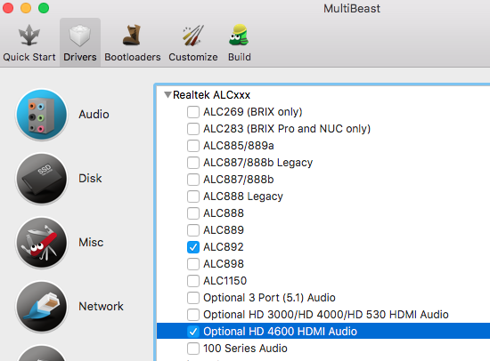
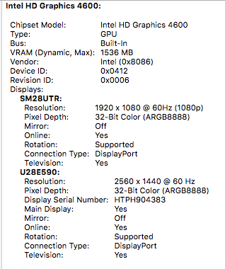
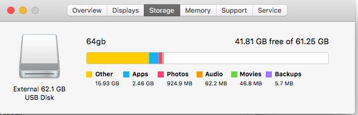

# ZBOX IQ01 PLUS hakintosh

This will help you install hakintosh (El Capitan) in IQ01 PLUS.

I am using 16gb/DDR3/1600Mhz with 64GB USB 3.0 Drive(130+Mbps)

Note : Wifi will not work, so I am using LAN (you need to change default wifi device compatible with MACs)

# installation

- Read installation from here : https://www.tonymacx86.com/threads/unibeast-install-os-x-el-capitan-on-any-supported-intel-based-pc.172672/

# IQ01 PLUS Specific :

(After Step 4) I am following Alternate steps 6

A. Download El Capitan Post-Install Tools (https://www.tonymacx86.com/resources/el-capitan-post-install-tools.294/)

1. Install Clover_v2.3k_r3320-UEFI.pkg

2. Install CustoMac Essentials.pkg

B. Download Clover configurator : (https://www.tonymacx86.com/resources/clover-configurator.335/)
- From SMBIOS , use wizard to select select MacBook Pro Retina(11,2)

[ Select a version with Haswell i7 CPU , i choose 4770 series ]

- You may save it
- Reboot

This will be make your hard drive rebootable.

C. Download Multibeast 8.2.3 (https://www.tonymacx86.com/resources/multibeast-el-capitan-8-2-3.319/) and run it. I configured like
- UEFI under quick start
- Drivers/Audio : ACL892 + HDMI Optional for HD 4600
- Drivers/Network : Realtek 8111v2.2.1
- Drivers/USB : Support for 7/8/9 series
- Boot loader UEFI
- Customize/Definations/Mac Pro Ratina 11,2 [try to select haswell version]

NOTE : From Brix Pro setup , only Sound Device Changed.

And install it. It will take 2/3 min. And you are done.

# Finally : Its running

